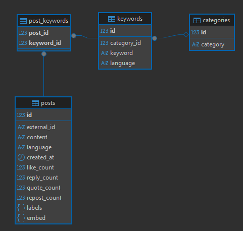

# Générateur de Mots-Clés et Collecteur de Posts

Ce projet permet de générer automatiquement des mots-clés à partir de catégories et de collecter des posts sur Bluesky contenant ces mots-clés. Il est conçu pour les développeurs, data analysts ou toute personne souhaitant extraire des informations pertinentes sur des sujets spécifiques à partir de réseaux sociaux.


## Authors

- [@AntoanetaStoyanova](https://www.github.com/AntoanetaStoyanova)

## Deployment

1. Exécution locale

```bash
git clone https://github.com/AntoanetaStoyanova/Content-Monitoring.git
cd content-monitoring
python3.13.7 -m venv venv
# Linux / Mac
source venv/bin/activate
# Windows
.venv\Scripts\activate
```
2. Installer les dépendances

```bash
pip install -r requirements.txt
```

4. Exécuter les scripts pour générer les mots-clés et collecter les posts

```bash
  python src/collect_posts.py
```


## Environment Variables

Créer un fichier .env à la racine du projet avec vos identifiants Bluesky

```
USERNAME_BLUESKY=<votre_username>
PASSWORD_BLUESKY=<votre_password>
```


## Features


## 1. Création des tavles (Etape préalable)
**src\db\create_tables.py** crée les tables nécessaires dans la base de données PostgreSQL.

### Tables créées:
    - categories : contient les catégories uniques.
    - keywords : contient les mots-clés associés aux catégories.
    - posts : contient les posts récupérés de Bluesky.
    - post_keywords : table d’association entre posts et mots-clés.



### Points clés:
    - les tables sont créées dans le schéma bluesky.
    - les relations entre tables sont assurées via des clés étrangères.

### Architecture:
src/
├─ db/
    ├─ create_tables.py
    └─__init__.py

### Execution:
```bash
python src/db/create_tables.py
```

## 2. Génération de mots-clés
Cette étape génère automatiquement des mots-clés pertinents à partir d’une liste de catégories, en plusieurs langues (français, anglais), grâce à un modèle NLP (Ollama), pour préparer la collecte de posts sur Bluesky.

    - Générer automatiquement une liste de mots-clés uniques pour chaque catégorie.
    - Préparer les mots-clés pour la collecte de posts.
    - Nettoyer et dédupliquer les mots-clés générés pour éviter les doublons.
    - Sauvegarder les mots-clés dans un base de donnée (PostgreSQL).
    - Logger toutes les opérations (création, erreurs, succès) dans log/app.log.

### Points clés:
    - Installer Ollama : https://ollama.com/download
    - Télécharger les modèles nécessaires, par exemple :
```bash
ollama pull mistral:7b
```

### Architecture:
src/
├─ generator_keywords/
│ ├─ __init__.py
│ ├─ categories_keywords.py
│ ├─ create_key_words.py
│ ├─ main.py
│ └─ test_db.py

### Execution:
```bash
python src/generator_keywords/main.py
```


### 3. Collecte de posts sur Bluesky
    - Se connecter à un compte Bluesky avec des identifiants stockés dans .env.
    - Collecter n_post
    - Traitement de mots clés 
        - pluriel + singuriel
    - Vérifier si les posts contiennent les mots clés
    - Extraire les informations importantes de chaque post :
        - mot-clé utilisé
        - auteur du post
        - texte du post

    - Sauvegarder les posts dans un base de donnée (PostgreSQL).

### Architecture:
src/
├─ collect/
│ ├─ __init__.py
│ ├─ collect_posts.py
│ ├─ posts_db.py
│ ├─ main.py

### Execution:
```bash
python src/collect/main.py
```
